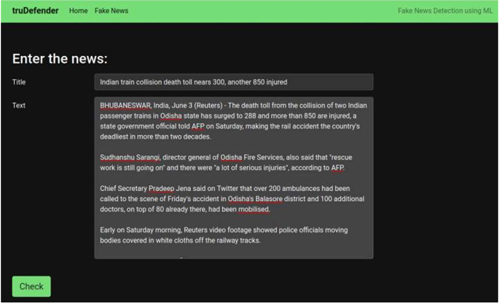
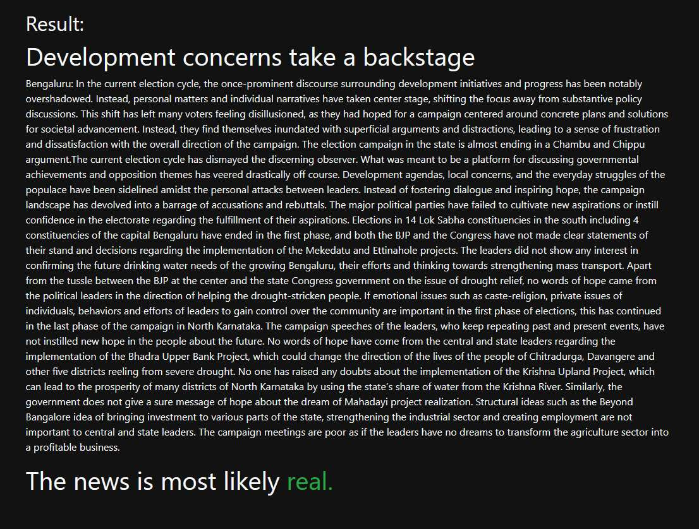

# Fake News Classifier — truDefender

A machine learning project that classifies news articles as **FAKE** or **REAL** using Natural Language Processing (NLP). Three classical models — Naive Bayes, Logistic Regression, and Stochastic Gradient Descent (SGD) — are trained and compared in the notebooks, and the best-suited model is served through a Flask web application called truDefender.

---

## Abstract

Misinformation and fake news have become a significant challenge in the digital age. This project tackles that problem in two parts: the `notebooks/` directory explores and compares three NLP-based classifiers on a labelled news dataset, and `app/` serves the trained model through a clean web interface where a user can paste an article (or a URL to one) and get an instant FAKE/REAL prediction.

---

## Notebooks

The dataset and model comparison live in `notebooks/`:

| Model | Notebook |
|---|---|
| Naive Bayes | `notebooks/Fake News Classifier.ipynb` |
| Logistic Regression | `notebooks/news-classification-logistic-regression.ipynb` |
| Stochastic Gradient Descent | `notebooks/news-classification-stochastic-gradient-descent.ipynb` |

Each notebook reads the shared dataset from `notebooks/dataset/news.csv`, vectorizes the article text (CountVectorizer or TF-IDF, depending on the notebook), trains its classifier, and reports test-set accuracy. The trained model used by the web app is exported as `app/model/fake_news_classification.pkl`.

**To run a notebook:**
```bash
cd notebooks
jupyter notebook
```

---

## Web Application

truDefender is the Flask front-end for the trained model. A user enters a news **title** and **body text** (or a source URL), and the app returns either **FAKE NEWS ⚠️** or **REAL NEWS 👍**.

| | |
|---|---|
|  |  |
| Front page | Manually entering an article |
|  |  |
| Classifying from a source URL | Classification result |

### How It Works

1. User enters a news **title** and **body text**, or pastes a source URL
2. The text is concatenated and passed to the trained classifier
3. The model outputs either **FAKE NEWS ⚠️** or **REAL NEWS 👍**

### Usage

**Step 1 — Clone the repository**
```bash
git clone https://github.com/keeeg4n/fake_news_classifier.git
cd fake_news_classifier
```

**Step 2 — Create and activate a virtual environment**
```bash
python3 -m venv venv

# Linux / macOS
source venv/bin/activate

# Windows
venv\Scripts\activate
```

**Step 3 — Install dependencies**
```bash
pip install -r requirements.txt
```

**Step 4 — Run the app**
```bash
cd app
python server.py
```

**Step 5 — Open in browser**

Navigate to `http://127.0.0.1:5000`, enter a news title and body, and click **Check**.

---

## Tech Stack

| Category | Tools |
|---|---|
| Language | Python |
| Web Framework | Flask |
| ML / NLP | scikit-learn, joblib |
| Data Handling | Pandas, NumPy |
| Visualisation | Seaborn, Plotly |
| Frontend | Bootstrap 5, Jinja2 |

---

## Project Structure

```
fake_news_classifier/
├── requirements.txt
├── docs/
│   └── screenshots/                          # Web app screenshots used in this README
├── notebooks/
│   ├── dataset/
│   │   ├── news.csv
│   │   └── news.zip
│   ├── Fake News Classifier.ipynb
│   ├── news-classification-logistic-regression.ipynb
│   └── news-classification-stochastic-gradient-descent.ipynb
└── app/
    ├── server.py                   # Flask web application
    ├── fake_news_model.py          # Model loader and prediction logic
    ├── model/
    │   └── fake_news_classification.pkl      # Trained model served by the app
    ├── templates/
    │   ├── base.html
    │   ├── index.html
    │   └── fake_news.html
    └── static/
        └── res/img/
```

---

## Requirements

- Python 3.8+

```bash
pip install flask joblib scikit-learn seaborn
```

---

## Applications

- **Media Literacy:** Helps readers verify news before sharing
- **Social Media Moderation:** Can be integrated as a content screening tool
- **Journalism:** Assists fact-checkers in flagging suspicious articles

---

## Advantages & Limitations

**Advantages**
- Fast inference — results in milliseconds
- Lightweight model, no GPU required
- Works on any news article regardless of topic

**Limitations**
- Model accuracy depends on the quality and diversity of training data
- May struggle with satirical content or opinion pieces
- Not a definitive fact-checking tool — always verify with trusted sources
